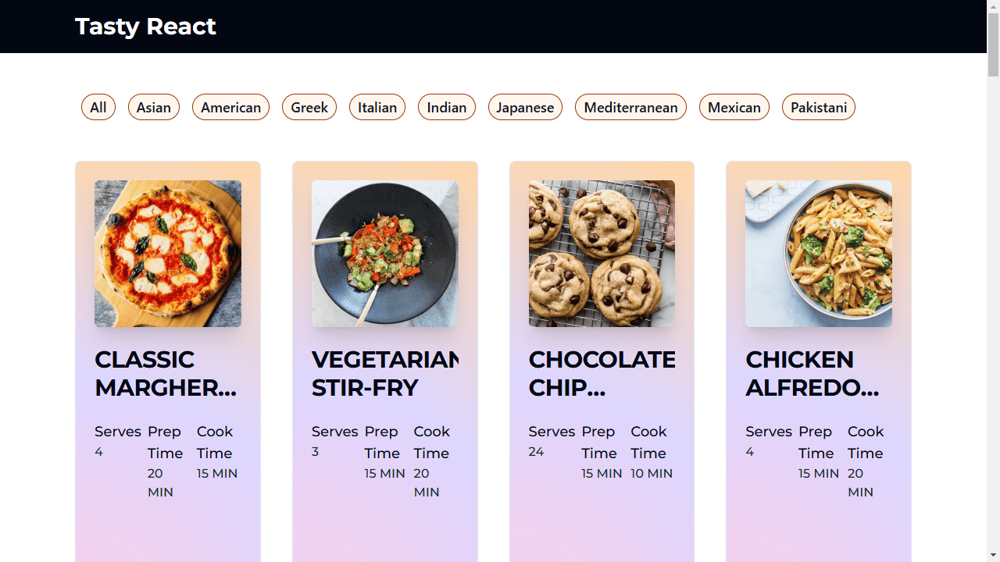
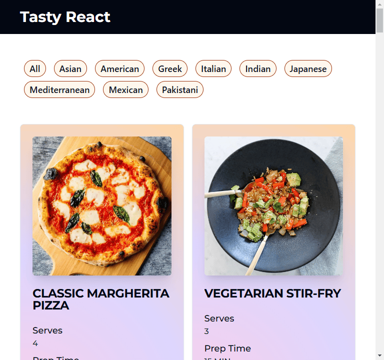
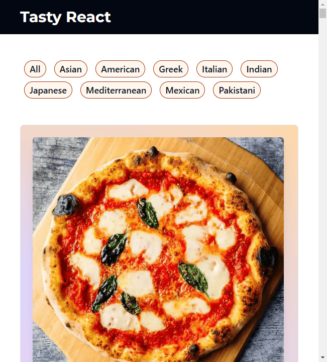
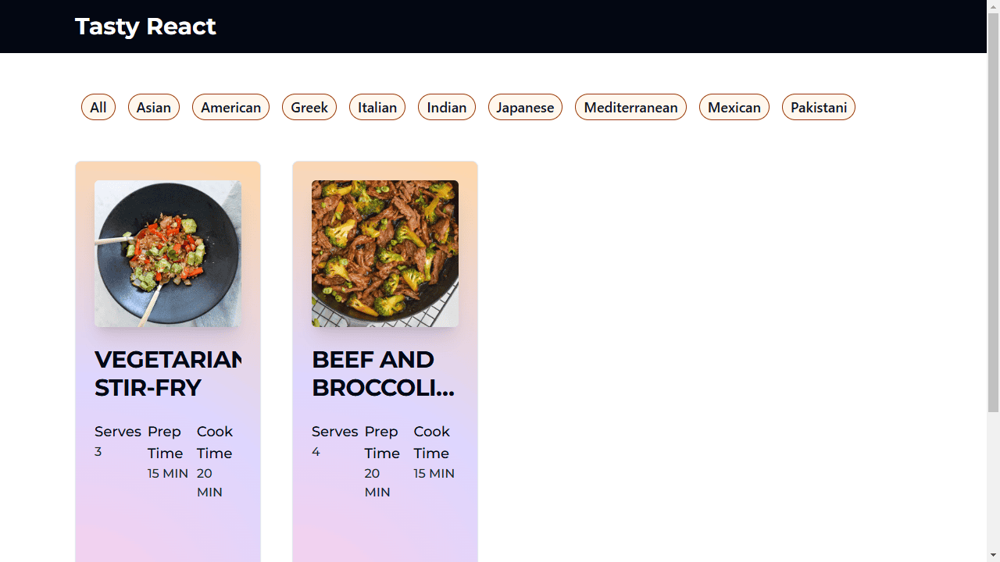
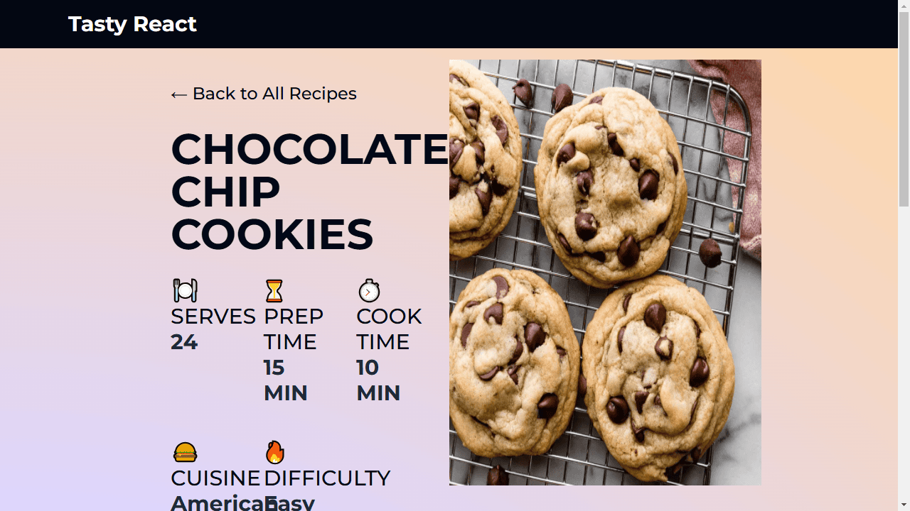

# React Pages
Simpler React projects with one or a few pages.

## [Recipes #1](https://github.com/levdoescode-practice/react/tree/path-001)
* Simple recipe page design using [React](https://react.dev/) with [shadcn](https://ui.shadcn.com/) components,
[Tailwind](https://tailwindcss.com/) styling and some [TypeScript](https://www.typescriptlang.org/) for recipes.
* Filter by category and individual recipe pages.
* Data from [dummyjson.com](https://dummyjson.com/recipes/)

*Images below are static links only

    
    

    
    
    
    

