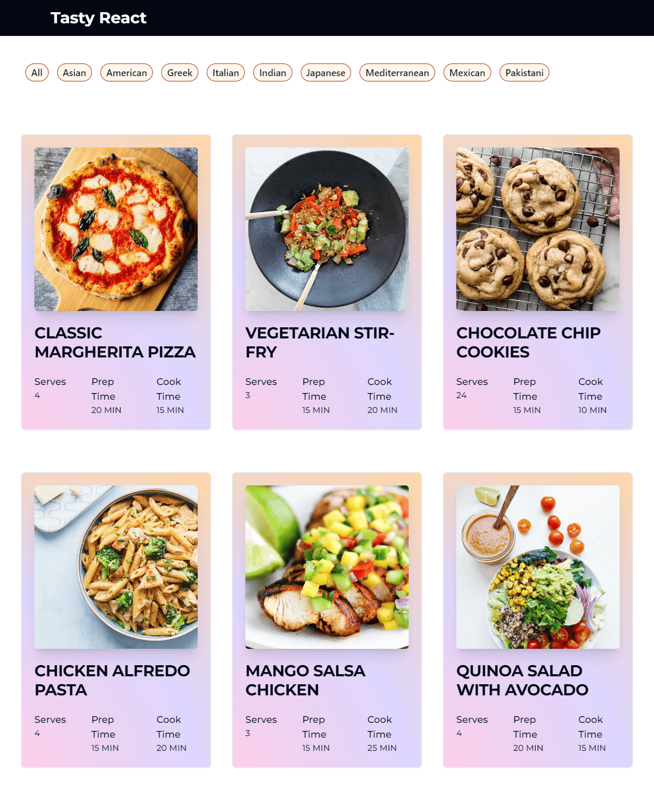

# Next Recipe Project

From tutorial by Ankita Kulkarni https://www.youtube.com/watch?v=JB1aKAoj2o0

# Resulting Page
- Responsive recipe cards using Tailwind
- Dynamic routes for recipe pages
- Filter and recipe state saved with `useState` hook

# Instructions

- `npm run dev`
- `npm run build`
- `npm run start`
