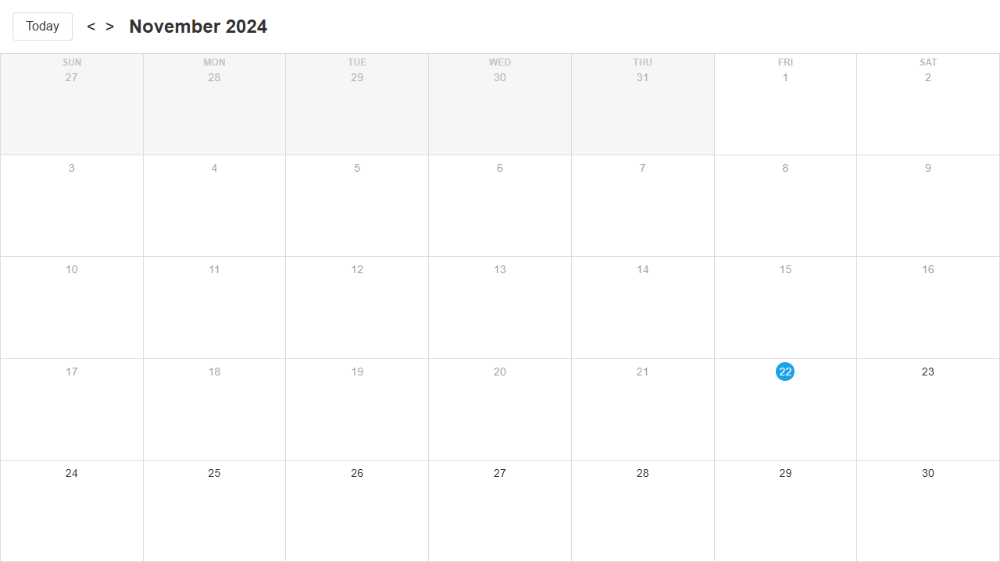
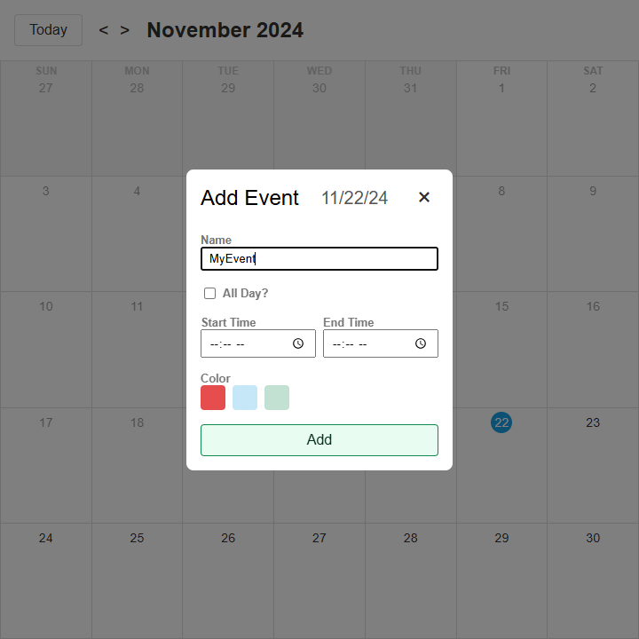
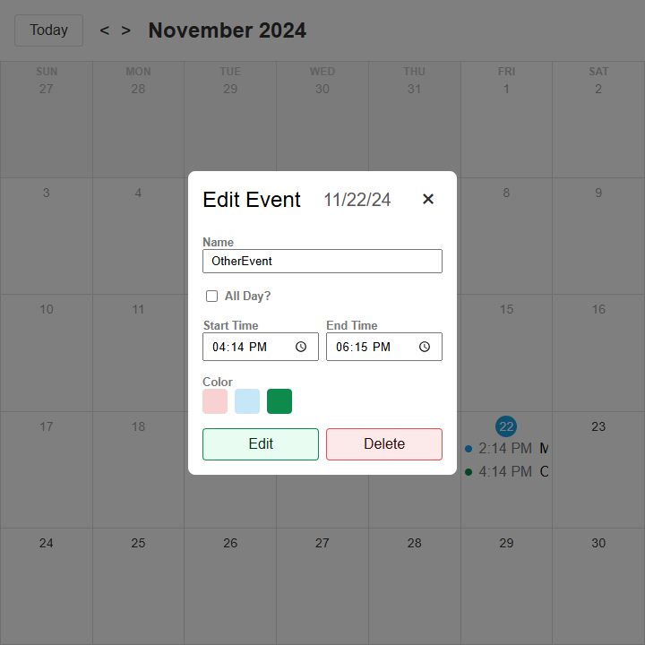
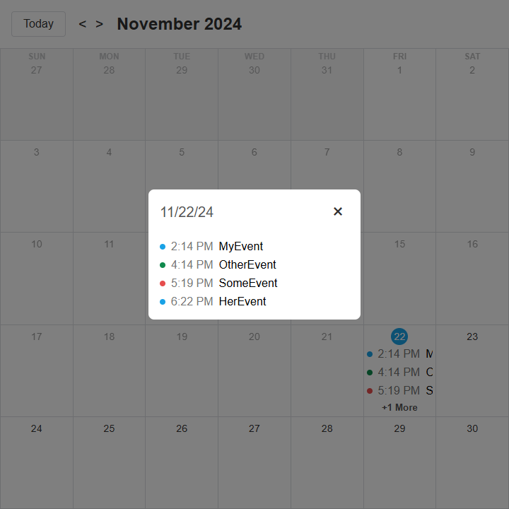

# React Pages
Projects with one or a few pages.

## [Recipes #1](https://github.com/levdoescode-practice/react/tree/path-001)
* Simple recipe page design using [React](https://react.dev/) with [shadcn](https://ui.shadcn.com/) components,
[Tailwind](https://tailwindcss.com/) styling and some [TypeScript](https://www.typescriptlang.org/) for recipes.
* Filter by category and individual recipe pages.
* Data from [dummyjson.com](https://dummyjson.com/recipes/)

    

    
    
    
    

## [Calendar #1](https://github.com/levdoescode-practice/typescript/tree/path-001/11-calendar-project)
* Single page calendar using [TypeScript](https://www.typescriptlang.org/), [React](https://react.dev/) and [Vite](https://vite.dev/).
* Modal for adding and editing day events along with proper validations.
* Types for context, props and modals.
* Event data saved on local storage for persistance.

    

    
    
    

