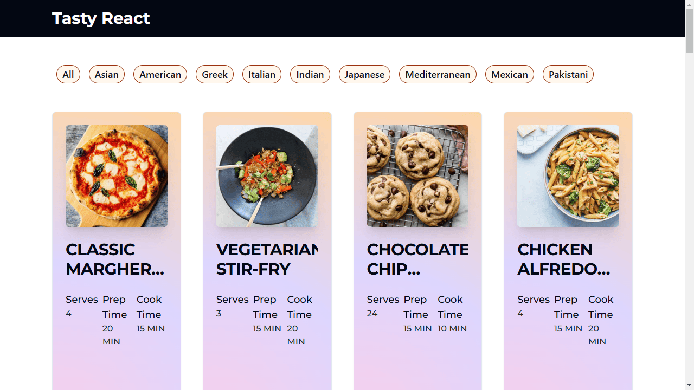
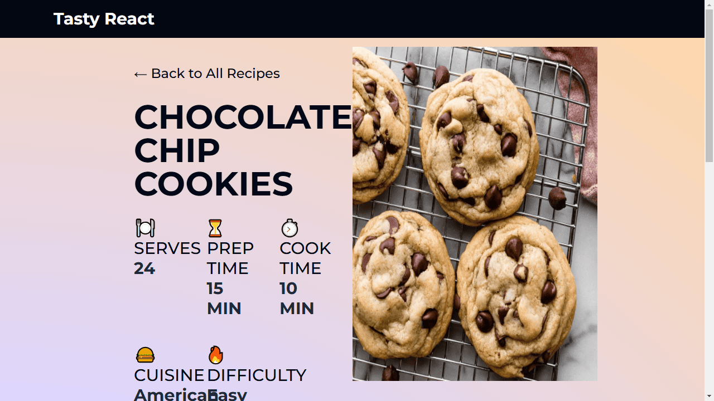

  <!-- Large image display -->
  

    
  

  <!-- Grid of smaller images -->
  

    <input type="radio" name="gallery" id="image1" checked>
    <label for="image1">
      
    </label>

    <input type="radio" name="gallery" id="image2">
    <label for="image2">
      
    </label>

    <input type="radio" name="gallery" id="image3">
    <label for="image3">
      
    </label>

    <input type="radio" name="gallery" id="image4">
    <label for="image4">
      
    </label>

    <input type="radio" name="gallery" id="image5">
    <label for="image5">
      
    </label>
  

